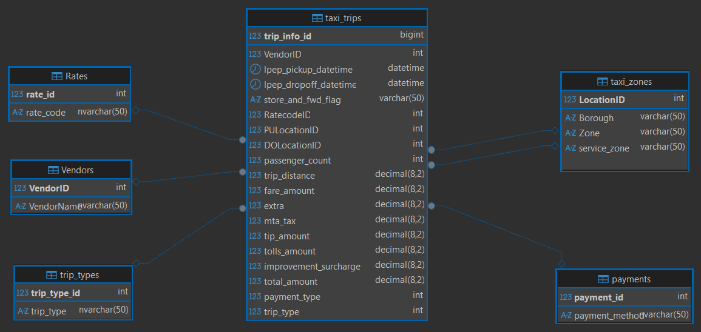
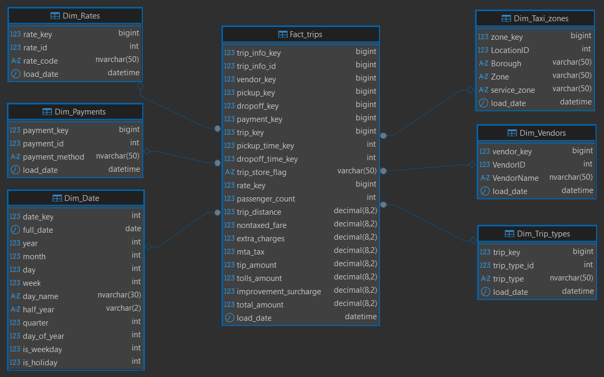
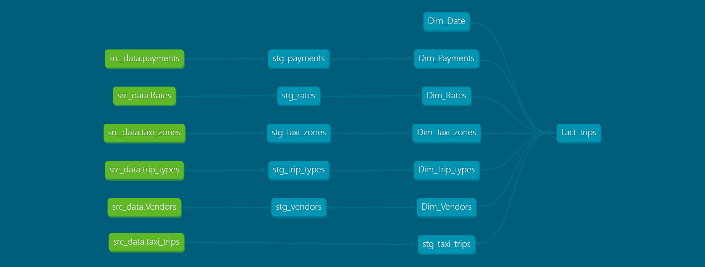

# Newyork Taxi Trips analysis using dbt & MS SQL Server

## Project Objectives
This project builds a modern data warehouse and dimensional model (star schema) for the New York City Taxi and Limousine Commission (TLC) public trip dataset using dbt (data build tool) on Microsoft SQL Server.

## Data Source
NYC Yellow Taxi Trip dataset from kaggle [dataset](https://www.kaggle.com/datasets/elemento/nyc-yellow-taxi-trip-data)

- The NYC Taxi trip dataset (published by the New York City Taxi and Limousine Commission, or TLC) captures detailed records of trips taken in licensed taxis (yellow medallion taxis, green street-hail liveries) and, in separate datasets, for-hire vehicles (FHVs like Uber, Lyft, etc.).

## convert the data set into database

## Data Warehouse design process
- use data to load the database tables from NYC_TAXI DB into a raw_data schema in  NYC_TAXI_DWH in MS SQL Server [Load_db_to_dwh.py](Insert_into_DB_script/load_db_to_dwh.py).

- use dbt tool to clean & transform the database to datawarehous and load data into analtycal schema.

## Four-Step Dimensional Design Process 
The four key decisions made during the design of a dimensional model include: 
1. Select the business process. 
2. Declare the grain. 
3. Identify the dimensions. 
4. Identify the facts.

#### 1. Select the business process.
- this is a taxi trip process to track trip details.

#### 2. Declare the grain.
- te grain of this dwh is the atomic grain means the row define one trip.

#### 3. Identify the dimensions. 
the dwh consists of star schema with one central Fact_trips table surrounded by 6 dimensions.
- #### Fact_trips
Central fact table that records each individual taxi trip, including measures (distances, fares, tips, taxes, surcharges) and foreign keys linking to all dimensions.

- #### Dim_Date
Date dimension containing calendar attributes (year, month, day, week, quarter, holidays, weekdays, etc.) used for analyzing trips by pickup and dropoff time.

- #### Dim_Payments
Payment dimension describing how the trip was paid (credit card, cash, no charge, dispute, etc.).

- #### Dim_Rates
Rate code dimension defining the fare structure applied to the trip (standard rate, JFK flat fare, Newark, negotiated, group ride, etc.).

- #### Dim_Taxi_zones
Location dimension containing the taxi zones used for pickup and dropoff of passengers, with borough, zone name, and service zone type.

- #### Dim_Vendors
Vendor dimension identifying the technology provider (TSP) that supplied the taximeter system recording the trip data.

- #### Dim_Trip_types
Trip type dimension (mainly for green taxis) indicating whether the trip was street-hail or dispatch.

#### Data warehouse modelling

## dbt Transformation Steps

#### 1- Source Layer
Raw tables loaded directly from the source system (using Python script copies them into the raw_data schema in the data warehouse).
These are defined as dbt sources (in sources.yml) for lineage and freshness checks.

#### 2- Staging Layer
Lightly transformed and cleaned versions of the raw source tables.
Purpose:
Rename columns to consistent, clean names,
cast data types correctly (e.g., datetime, decimal).
Basic filtering (remove invalid rows).
These models use {{ source(...) }} to reference raw tables.

#### 3-Warehouse
Final dimensional model (star schema) ready for analysis and reporting.
Dimension tables (Dim_*): static dimensions.
Fact table (Fact_trips): Grain = one row per trip, with foreign keys to all dimensions and all monetary/quantity measures.
These models reference staging models via {{ ref(...) }} and join them together.

#### dbt lineage

## Prerequisites
- Microsoft SQL Server (Express or higher)
- Python 3.10+ with pandas, sqlalchemy, pyodbc
- dbt-core and dbt-sqlserver adapter

## Database & Schemas Creation in MS SQL Server

#### Create Database
    CREATE DATABASE NYC_TAXI_DWH

#### Create raw_data Schema
    CREATE SCHEMA raw_data AUTHORIZATION dbo;

#### Create stage Schema
    CREATE SCHEMA staging AUTHORIZATION  dbo;

#### Create analtycal Schem
    CREATE SCHEMA analtycal AUTHORIZATION dbo;

## dbt and sql-adapter Installation 
    # Create virtual environment
        python -m venv dbt-env
    # Activate it
        dbt-env\Scripts\activate  
    # Install dbt-core and the SQL Server adapter
        pip install dbt-core dbt-sqlserver      

## Quick Start
1. Clone the repo: `git clone https://github.com/Aminsfwt/NYC-TAXI-TRIPS.git `
2. Load raw data: `python Insert_into_DB_script/load_db_to_dwh.py`
3. Install dbt deps: `dbt deps`
4. Run models: `dbt run`
5. Test: `dbt test`
6. View lineage: `dbt docs generate && dbt docs serve`

#### Run Project
    dbt deps      # Install packages
    dbt run       # Build models
    dbt test      # Run tests
    dbt docs generate && dbt docs serve  # View documentation locally
